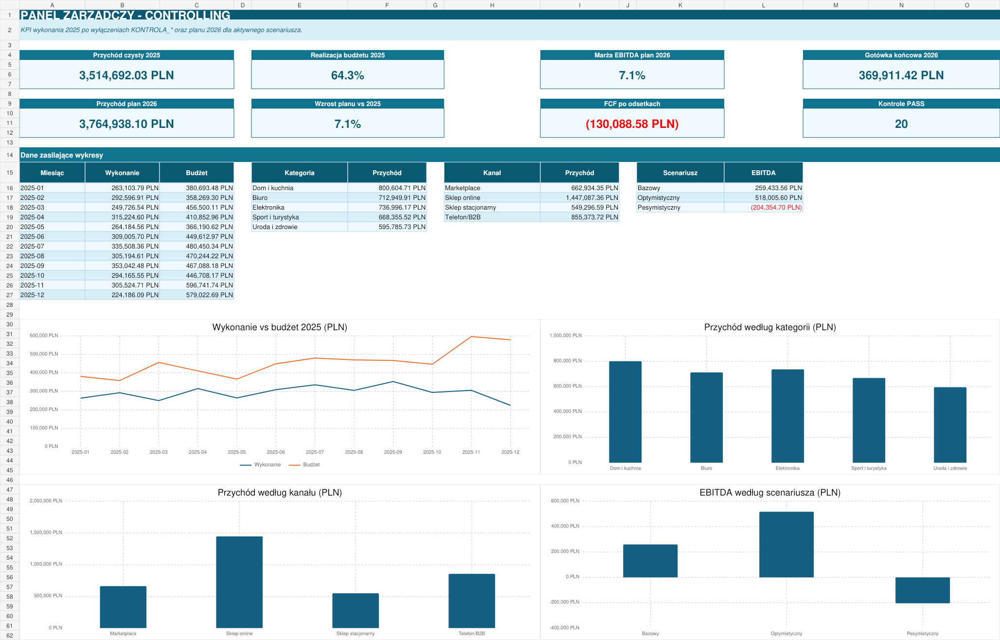
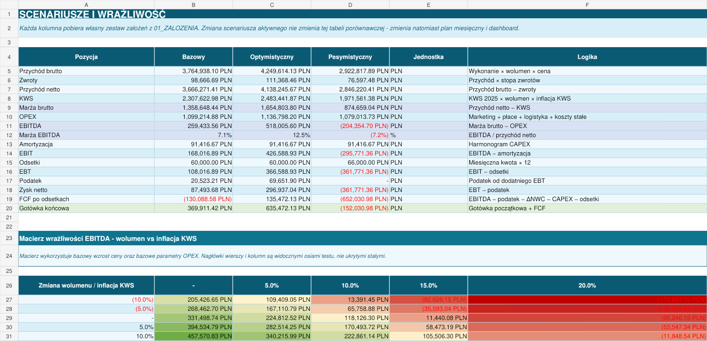

# Analiza sprzedaży i model finansowo-controllingowy w Excelu



Projekt łączy dwa skoroszyty pracujące na tym samym materiale źródłowym. Pierwszy służy do analizy sprzedaży, budżetu, marży, zwrotów i zapasów. Drugi rozwija wynik operacyjny do planu finansowego na 2026 rok, rachunku wyników, przepływów pieniężnych, kapitału obrotowego i scenariuszy.

Dane są syntetyczne. Zostały przygotowane tak, aby odwzorować problemy spotykane przy pracy z raportami sprzedażowymi: różne formaty, braki, niejednolite słowniki i rekordy wymagające decyzji biznesowej.

## Pliki projektu

| Plik | Zastosowanie |
| --- | --- |
| [`project/Analiza_Sprzedazy_Excel.xlsx`](project/Analiza_Sprzedazy_Excel.xlsx) | Power Query, Power Pivot, DAX, analizy operacyjne i dashboard |
| [`project/Model_Finansowo_Controllingowy.xlsx`](project/Model_Finansowo_Controllingowy.xlsx) | wykonanie 2025 po kontrolach, budżet, plan 2026, P&L, cash flow i scenariusze |
| [`data/Dane_surowe_projekt_Excel.xlsx`](data/Dane_surowe_projekt_Excel.xlsx) | niezmienione dane źródłowe do skoroszytu analitycznego |

## Co zostało wykonane

- oczyszczenie i ujednolicenie danych w Power Query,
- tabele faktów i wymiarów w modelu gwiazdy,
- relacje Power Pivot oraz miary DAX,
- analizy czasu, kategorii, kanałów, zwrotów i magazynu,
- dashboard z fragmentatorami kategorii i kanału oraz osią czasu,
- jawne wyłączenia rekordów `KONTROLA_*`, bez usuwania śladu audytowego,
- budżet i plan finansowy w podziale na miesiące,
- rachunek wyników, zatrudnienie, OPEX, CAPEX i amortyzacja,
- kapitał obrotowy, przepływy pieniężne i stan gotówki,
- analiza ceny, wolumenu i miksu,
- próg rentowności i trzy scenariusze,
- 20 kontroli spójności modelu.

## Najważniejsze wyniki modelu finansowego

Poniższe wartości dotyczą scenariusza bazowego. Wykonanie 2025 i budżet 2025 są pokazane po wyłączeniu rekordów ujętych w arkuszach `KONTROLA_*`.

| Wskaźnik | Wynik |
| --- | ---: |
| Przychód po kontrolach 2025 | 3 514 692,03 zł |
| Czysty budżet 2025 | 5 462 374,78 zł |
| Realizacja budżetu 2025 | 64,34% |
| Plan przychodu 2026 | 3 764 938,10 zł |
| Wzrost planu względem 2025 | 7,12% |
| EBITDA 2026 | 259 433,56 zł |
| Marża EBITDA 2026 | 7,08% |
| FCF po odsetkach | -130 088,58 zł |
| Gotówka końcowa | 369 911,42 zł |
| Kontrole modelu | 20 PASS, 0 FAIL |

## Wnioski

1. Wykonanie po kontrolach pokrywa 64,34% czystego budżetu. Luka wynosi 1,95 mln zł, dlatego plan sprzedaży wymaga rozbicia na kanały, miesiące i właścicieli działań.
2. Telefon/B2B przekracza własny budżet, podczas gdy kanały masowe pozostają poniżej planu. Rozwój B2B powinien iść razem z kontrolą rabatów, marży i koncentracji klientów.
3. Sklep online jest największym kanałem, ale nie realizuje założonego budżetu. Lukę warto analizować osobno przez ruch, konwersję, liczbę zamówień i średnią wartość koszyka.
4. Elektronika ma najsłabszą marżę wśród kategorii oraz największą lukę do budżetu w raporcie operacyjnym. Do sprawdzenia są ceny, rabaty, koszt zakupu i realność planu.
5. Scenariusz bazowy daje dodatnią EBITDA, ale ujemny FCF po odsetkach. Wzrost angażuje gotówkę w kapitał obrotowy i CAPEX, więc sama rentowność operacyjna nie wystarcza do oceny płynności.
6. W scenariuszu pesymistycznym gotówka końcowa spada do -152,03 tys. zł. Model wskazuje potrzebę limitów DSO, zapasu i CAPEX oraz wcześniejszej reakcji na spadek sprzedaży.

Szczegółowe liczby i rekomendacje znajdują się w pliku [`documentation/wnioski-biznesowe.md`](documentation/wnioski-biznesowe.md).

## Trzy scenariusze 2026

| Wskaźnik | Bazowy | Optymistyczny | Pesymistyczny |
| --- | ---: | ---: | ---: |
| Przychód brutto | 3 764 938,10 zł | 4 249 614,13 zł | 2 922 817,89 zł |
| EBITDA | 259 433,56 zł | 518 005,60 zł | -204 354,70 zł |
| Marża EBITDA | 7,08% | 12,52% | -7,18% |
| FCF po odsetkach | -130 088,58 zł | 135 472,13 zł | -652 030,98 zł |
| Gotówka końcowa | 369 911,42 zł | 635 472,13 zł | -152 030,98 zł |



## Zakresy raportowania

Skoroszyt analityczny i model finansowy mają różne zadania, dlatego ich wartości sprzedaży i budżetu nie są identyczne.

- Dashboard operacyjny korzysta z miar DAX i filtrów statusu, daty oraz relacji w modelu danych.
- Model finansowy zaczyna od uzgodnionych agregatów źródłowych, a następnie wyłącza wszystkie rekordy pokazane w arkuszach `KONTROLA_*`.
- Różnice nie zostały ręcznie wyrównane. Ich pochodzenie jest opisane w arkuszach `00_INSTRUKCJA`, `05_WYLACZENIA_KONTROLNE` i `25_ZRODLA_I_WNIOSKI`.

Dokładne zasady zakresu opisuje plik [`documentation/zakres-danych-i-ograniczenia.md`](documentation/zakres-danych-i-ograniczenia.md).

## Dashboard sprzedażowy


Dashboard pokazuje przychód, przychód po zwrotach, marżę, budżet, realizację planu i wartość zwrotów. Wykresy porównują miesiące, kategorie, kanały i powody zgłoszeń. Fragmentatory oraz oś czasu działają w Microsoft Excel Desktop.

Wartości dla zakresu operacyjnego dashboardu:

| Wskaźnik | Wynik |
| --- | ---: |
| Przychód zrealizowany | 3 536 247,41 zł |
| Przychód po zwrotach | 3 449 254,06 zł |
| Marża | 1 332 828,26 zł |
| Marża procentowa | 37,69% |
| Liczba zamówień | 1 313 |
| Budżet | 5 784 080,94 zł |
| Realizacja budżetu | 61,14% |

## Model danych

Model analityczny ma cztery tabele faktów i wspólne wymiary. Relacje prowadzą od tabel `DIM` do tabel `FAKT`.


Główne tabele:

- `FAKT_Sprzedaz`,
- `FAKT_Budzet`,
- `FAKT_Zwroty`,
- `FAKT_Magazyn`,
- `DIM_Data`,
- `DIM_PRODUKTY`,
- `DIM_KLIENCI`,
- `DIM_Kategoria`,
- `DIM_Kanal`.

Opis relacji znajduje się w pliku [`documentation/model-danych.md`](documentation/model-danych.md).

## Struktura repozytorium

```text
Excel-Analysis-Dashboard/
├── README.md
├── data/
│   ├── Dane_surowe_projekt_Excel.xlsx
│   └── README.md
├── project/
│   ├── Analiza_Sprzedazy_Excel.xlsx
│   ├── Model_Finansowo_Controllingowy.xlsx
│   └── README.md
├── screenshots/
│   ├── dashboard.png
│   ├── panel-zarzadczy.png
│   ├── rachunek-wynikow.png
│   ├── scenariusze.png
│   ├── prog-rentownosci.png
│   ├── kontrole-modelu.png
│   ├── model-danych.png
│   ├── analiza-czas.png
│   ├── analiza-kategorie.png
│   └── analiza-kanaly.png
└── documentation/
    ├── przygotowanie-danych.md
    ├── model-danych.md
    ├── miary-dax.md
    ├── model-finansowo-controllingowy.md
    ├── zakres-danych-i-ograniczenia.md
    └── wnioski-biznesowe.md
```

## Jak uruchomić projekt

1. Pobierz repozytorium lub sklonuj je lokalnie.
2. Otwórz pliki z katalogu [`project`](project/) w Microsoft Excel Desktop dla Windows.
3. W skoroszycie analitycznym przejdź do arkusza `DASHBOARD`.
4. W modelu finansowym zacznij od `00_INSTRUKCJA`, następnie sprawdź `23_PANEL_ZARZADCZY` i `24_KONTROLE_MODELU`.
5. Przy odświeżaniu Power Query wskaż lokalną ścieżkę do pliku z katalogu `data`, jeżeli Excel o nią poprosi.

Excel Online może wyświetlić część zawartości, ale nie obsługuje pełnego zakresu Power Pivot, DAX, fragmentatorów i osi czasu.

## Dokumentacja

- [Przygotowanie danych w Power Query](documentation/przygotowanie-danych.md)
- [Model danych i relacje](documentation/model-danych.md)
- [Miary DAX](documentation/miary-dax.md)
- [Model finansowo-controllingowy](documentation/model-finansowo-controllingowy.md)
- [Zakres danych i ograniczenia](documentation/zakres-danych-i-ograniczenia.md)
- [Wnioski biznesowe](documentation/wnioski-biznesowe.md)

## Autor

Oskar Kowalczyk
