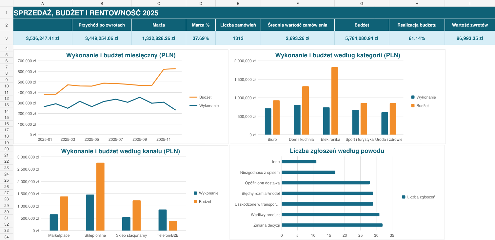
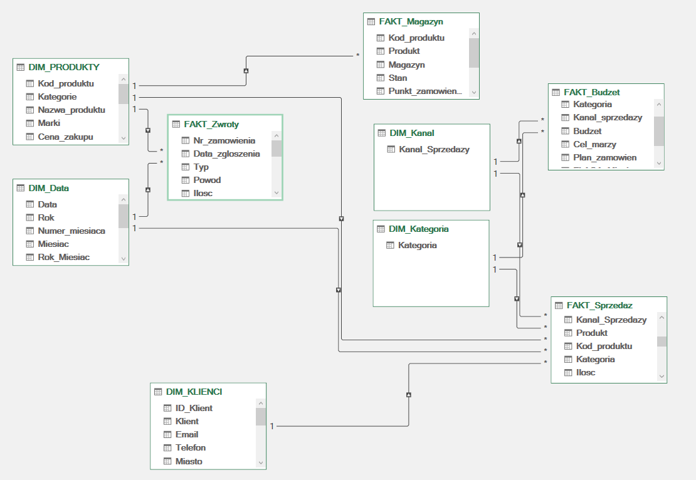
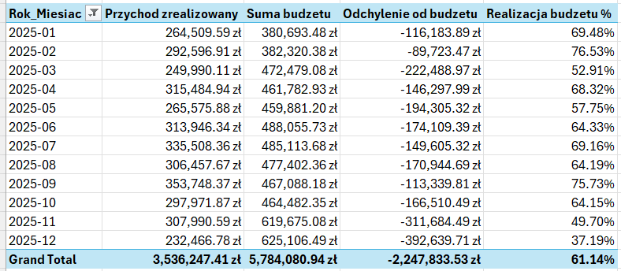
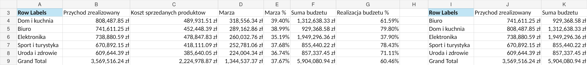
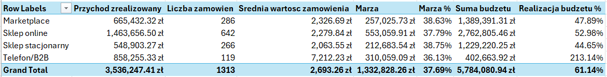

# Analiza sprzedaży i budżetu w Excelu



Projekt przedstawia pełny proces pracy z danymi sprzedażowymi w Excelu: od surowego, celowo zabrudzonego pliku, przez transformacje Power Query i model Power Pivot, po miary DAX, tabele przestawne oraz interaktywny dashboard.

Dane są syntetyczne, ale zostały przygotowane tak, aby przypominały materiały spotykane w pracy analityka: niespójne nazwy, różne formaty liczb i dat, braki danych, błędne kody produktów oraz rekordy wymagające kontroli biznesowej.

## Co zrobiłem w projekcie

- oczyściłem i ujednoliciłem dane w Power Query,
- przygotowałem tabele faktów i wymiarów,
- zbudowałem model danych w układzie gwiazdy,
- połączyłem sprzedaż z klientami, produktami, kalendarzem, kategoriami i kanałami,
- utworzyłem miary DAX dla sprzedaży, marży, budżetu i zwrotów,
- przygotowałem osobne analizy czasu, kategorii, kanałów, zwrotów i magazynu,
- zbudowałem dashboard sterowany fragmentatorami i osią czasu,
- zachowałem arkusze kontroli jakości, aby problemy źródłowe były widoczne i możliwe do audytu.

## Najważniejsze wyniki

Wartości dla pełnego zakresu danych 2025 zapisanych w skoroszycie:

| Wskaźnik | Wynik |
| --- | ---: |
| Przychód zrealizowany | 3 569 516,24 zł |
| Przychód po zwrotach | 3 475 970,92 zł |
| Marża | 1 344 537,37 zł |
| Marża procentowa | 37,67% |
| Liczba zrealizowanych zamówień | 1 318 |
| Średnia wartość zamówienia | 2 708,28 zł |
| Budżet sprzedaży | 5 904 080,94 zł |
| Realizacja budżetu | 60,46% |
| Kwota zwrotów | 93 545,32 zł |

## Krótkie wnioski

- Największy przychód wygenerowała kategoria **Dom i kuchnia**: 808,5 tys. zł.
- Najwyższą realizację budżetu wśród kategorii osiągnęło **Biuro**: 79,80%.
- Kanał **Telefon/B2B** przekroczył budżet ponad dwukrotnie, osiągając 219,86% realizacji.
- Największą skalę sprzedaży miał **Sklep online**: 1,47 mln zł, ale realizacja budżetu wyniosła 50,92%.
- W tabeli zwrotów i reklamacji znajduje się 187 zgłoszeń; najczęstszym powodem była zmiana decyzji klienta.

Szczegółowe omówienie znajduje się w pliku [`documentation/wnioski-biznesowe.md`](documentation/wnioski-biznesowe.md).

## Model danych

Model składa się z czterech tabel faktów oraz wspólnych wymiarów. Relacje mają kardynalność jeden-do-wielu, a filtrowanie przebiega od tabel `DIM` do tabel `FAKT`.



Główne tabele:

- `FAKT_Sprzedaz` - pozycje sprzedażowe,
- `FAKT_Budzet` - miesięczne plany według kategorii i kanału,
- `FAKT_Zwroty` - zwroty i reklamacje,
- `FAKT_Magazyn` - stany produktów w magazynach,
- `DIM_Data`, `DIM_PRODUKTY`, `DIM_KLIENCI`, `DIM_Kategoria`, `DIM_Kanal` — tabele opisowe i filtrujące.

Szczegóły relacji: [`documentation/model-danych.md`](documentation/model-danych.md).

## Dashboard i analizy

Dashboard zawiera:

- KPI sprzedażowe i budżetowe,
- sprzedaż oraz budżet w kolejnych miesiącach,
- porównanie kategorii,
- wyniki kanałów sprzedaży,
- analizę powodów zwrotów i reklamacji,
- fragmentatory kategorii i kanału oraz oś czasu.

Poniżej znajdują się dodatkowe widoki tabel analitycznych zapisanych w skoroszycie.

### Analiza czasu



### Analiza kategorii



### Analiza kanałów



Pełny zestaw podglądów znajduje się w katalogu [`screenshots`](screenshots/).

## Zakres danych źródłowych

| Obszar | Zakres w pliku źródłowym |
| --- | ---: |
| Wiersze sprzedaży | ok. 2 500 |
| Produkty | ok. 90 |
| Klienci | ponad 430 |
| Zwroty i reklamacje | ok. 190 |
| Budżet | ok. 240 rekordów |
| Stany magazynowe | ok. 270 rekordów |

Plik źródłowy znajduje się w katalogu [`data`](data/). Zawiera dane celowo zabrudzone, dlatego częścią projektu są zarówno transformacje, jak i arkusze kontrolne.

## Użyte narzędzia

- Microsoft Excel Desktop,
- Power Query,
- Power Pivot,
- DAX,
- tabele i wykresy przestawne,
- fragmentatory i oś czasu,
- Git oraz GitHub.

## Struktura repozytorium

```text
Excel-Analysis-Dashboard/
├── README.md
├── data/
│   ├── Dane_surowe_projekt_Excel.xlsx
│   └── README.md
├── project/
│   ├── Analiza_Sprzedazy_Excel.xlsx
│   └── README.md
├── screenshots/
│   ├── dashboard-interaktywny.png
│   ├── model-danych.png
│   ├── analiza-czas.png
│   ├── analiza-kategorie.png
│   └── analiza-kanaly.png
└── documentation/
    ├── przygotowanie-danych.md
    ├── model-danych.md
    ├── miary-dax.md
    └── wnioski-biznesowe.md
```

## Jak uruchomić projekt

1. Pobierz repozytorium lub sklonuj je lokalnie.
2. Otwórz [`project/Analiza_Sprzedazy_Excel.xlsx`](project/Analiza_Sprzedazy_Excel.xlsx) w programie Microsoft Excel Desktop.
3. Przejdź do arkusza `DASHBOARD`.
4. Użyj fragmentatorów i osi czasu do filtrowania raportu.
5. Aby przejrzeć model, wybierz **Power Pivot → Manage → Diagram View**.

Po przeniesieniu repozytorium na inny komputer Power Query może poprosić o wskazanie nowej ścieżki do pliku źródłowego z katalogu `data`.

## Dokumentacja

- [Przygotowanie i kontrola danych](documentation/przygotowanie-danych.md)
- [Model danych i relacje](documentation/model-danych.md)
- [Miary DAX](documentation/miary-dax.md)
- [Wnioski biznesowe](documentation/wnioski-biznesowe.md)

## Autor

Oskar Kowalczyk
