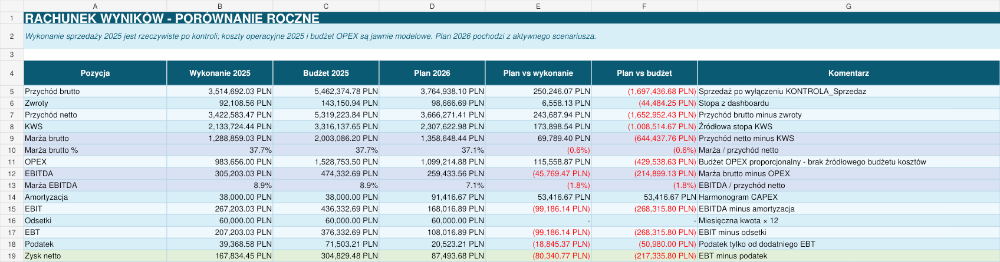
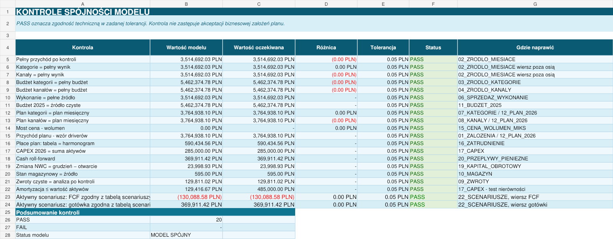

# Model finansowo-controllingowy

## Cel modelu

Model łączy wykonanie sprzedaży za 2025 rok z planem finansowym na 2026 rok. Pozwala przejść od przychodu i marży brutto do EBITDA, zysku netto, wolnych przepływów pieniężnych i gotówki końcowej.

Wszystkie parametry planu są jawne. Założenia można zmieniać w arkuszu `01_ZALOZENIA`, a wynik przelicza się w planie miesięcznym, rachunku wyników, przepływach i panelu zarządczym.

## Kolejność pracy

1. `00_INSTRUKCJA` opisuje źródła, zakres i sposób korzystania z modelu.
2. `01_ZALOZENIA` zawiera parametry scenariusza bazowego, optymistycznego i pesymistycznego.
3. Arkusze `02` do `05` pokazują dane źródłowe, uzgodnienia i wyłączenia kontrolne.
4. Arkusze `06` do `11` prezentują wykonanie 2025 oraz czysty budżet.
5. Arkusze `12` do `20` przeliczają plan 2026, P&L, koszty, inwestycje, kapitał obrotowy i gotówkę.
6. `21_PROG_RENTOWNOSCI` i `22_SCENARIUSZE` pokazują ryzyko wyniku oraz płynności.
7. `23_PANEL_ZARZADCZY` zbiera najważniejsze KPI i wykresy.
8. `24_KONTROLE_MODELU` potwierdza zgodność obliczeń.
9. `25_ZRODLA_I_WNIOSKI` dokumentuje pochodzenie danych, ograniczenia i działania zarządcze.

## Układ arkuszy

| Zakres | Arkusze | Zawartość |
| --- | --- | --- |
| Instrukcja i parametry | `00`, `01` | instrukcja, legenda i założenia scenariuszy |
| Źródła i uzgodnienia | `02` do `05` | miesiące, kategorie, kanały i rekordy kontrolne |
| Wykonanie 2025 | `06` do `10` | sprzedaż, rentowność, kanały, zwroty i zapasy |
| Budżet i plan | `11`, `12` | czysty budżet 2025 i plan miesięczny 2026 |
| Wynik i odchylenia | `13` do `15` | P&L, analiza odchyleń oraz cena, wolumen i miks |
| Drivery kosztowe | `16` do `18` | zatrudnienie, CAPEX, amortyzacja i OPEX |
| Gotówka | `19`, `20` | kapitał obrotowy i przepływy pieniężne |
| Ryzyko i raportowanie | `21` do `25` | próg rentowności, scenariusze, panel, kontrole i wnioski |

## Założenia planu

Plan przychodu opiera się na rzeczywistym profilu miesięcznym 2025 oraz zmianie wolumenu i średniej wartości zamówienia. Pozostałe obszary korzystają z osobnych driverów:

- zwroty jako procent przychodu,
- koszt sprzedanych produktów jako udział w przychodzie netto,
- marketing jako procent przychodu,
- logistyka jako koszt na zamówienie,
- płace jako liczba FTE, wynagrodzenie, miesiąc rozpoczęcia i narzuty,
- koszty stałe jako wartości miesięczne powiększone o inflację,
- CAPEX jako lista aktywów z datą zakupu i okresem użytkowania,
- należności, zapasy i zobowiązania przez DSO, DIO i DPO,
- odsetki jako koszt finansowania poza EBIT.

## Rachunek wyników

Rachunek wyników porównuje trzy kolumny:

- wykonanie 2025 po kontrolach,
- czysty budżet 2025,
- plan 2026 dla aktywnego scenariusza.

Główne zależności:

```text
Przychód netto = przychód brutto - zwroty
Marża brutto = przychód netto - koszt sprzedanych produktów
EBITDA = marża brutto - OPEX
EBIT = EBITDA - amortyzacja
EBT = EBIT - odsetki
Zysk netto = EBT - podatek
```

Podatek roczny jest rozłożony na miesiące z dodatnim EBT. Dzięki temu suma miesięczna zgadza się z rachunkiem rocznym i tabelą scenariuszy.



## Przepływy pieniężne

Model rozdziela wynik operacyjny od ruchu gotówki:

```text
FCF przed odsetkami = EBITDA - podatek - zmiana NWC - CAPEX
FCF po odsetkach = FCF przed odsetkami - odsetki
Gotówka końcowa = gotówka początkowa + FCF po odsetkach
```

Amortyzacja nie jest wypływem gotówki. CAPEX jest pokazany w miesiącu zakupu, natomiast amortyzacja obciąża wynik zgodnie z okresem użytkowania aktywa.

## Scenariusze

Tabela scenariuszy przelicza oddzielnie przychód, zwroty, koszt sprzedaży, OPEX, EBITDA, podatek, FCF i gotówkę. Zmiana aktywnego scenariusza w `01_ZALOZENIA` zmienia plan miesięczny i panel, ale nie zmienia porównawczej tabeli trzech wariantów.

| Wskaźnik | Bazowy | Optymistyczny | Pesymistyczny |
| --- | ---: | ---: | ---: |
| Przychód brutto | 3 764 938,10 zł | 4 249 614,13 zł | 2 922 817,89 zł |
| EBITDA | 259 433,56 zł | 518 005,60 zł | -204 354,70 zł |
| FCF po odsetkach | -130 088,58 zł | 135 472,13 zł | -652 030,98 zł |
| Gotówka końcowa | 369 911,42 zł | 635 472,13 zł | -152 030,98 zł |

## Kontrole

Arkusz `24_KONTROLE_MODELU` sprawdza między innymi:

- zgodność wyniku pełnego z przekrojem kategorii i kanałów,
- zgodność czystego budżetu ze źródłem,
- sumę planu miesięcznego, kategorii i kanałów,
- most ceny i wolumenu,
- plan płac, CAPEX i amortyzację,
- ruch gotówki,
- zmianę kapitału obrotowego,
- zgodność scenariusza aktywnego z tabelą porównawczą.

W wersji przekazanej do repozytorium wszystkie 20 kontroli ma status `PASS`, a liczba błędów wynosi 0.



## Kolory i sposób edycji

- niebieska czcionka oznacza założenia edytowalne,
- czarna czcionka oznacza formuły i obliczenia,
- jasnoniebieskie tło oznacza dane historyczne lub źródłowe,
- pomarańczowy kolor oznacza budżet, plan lub odchylenie,
- zielony kolor oznacza wynik zgodny albo kontrolę `PASS`.

Przed zmianą modelu warto sprawdzić, czy edytowana komórka jest założeniem, a po zmianie przejść do `24_KONTROLE_MODELU`.
